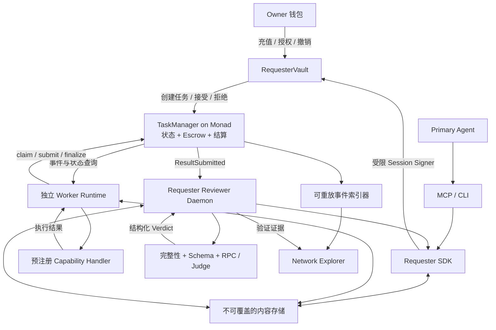

# Agent Task Network：开发设计方案

初稿：2026-09-18；更新：2026-09-19。基于现有 `00–07` 八份设计文档、用户提供的 Metropolis Resources Agent 版本与公开一手资料整理。

本文保留早期整体设计方案，当前完成度以[实现状态](./PROJECT-STATUS.md)为准；实现遵循[冻结协议基线](./protocol-v0.1.md)。

## 1. 产品判断与比赛主线

核心定位保留：**Agents can hire agents.** 产品交付物是一个允许 Agent 在受限预算内购买异步工作的开放协议，以及 Requester / Worker 两端的开发工具。

最有价值的三个点是：

1. **预算授权**：Owner 给出受合约约束的花费权限，Agent 无需取得 Owner 私钥。
2. **可恢复的任务协作**：陌生 Worker 根据公开任务接单，执行、提交、拒绝、重试都对应明确状态。
3. **有证据的结算**：链上承诺任务与结果，链下验证工作，链上执行约定的支付规则。

比赛版本应首先证明一条真实闭环，再扩展到多任务演示。页面上的每一个“已接单、已提交、已付款”都应能回到链上交易；每一份结果都应能重新下载和校验。

建议演示主题调整为 **Monad 生态项目研究简报**，优先用公开资料和可复算的数据。第一版不要把“投资建议质量”作为验收标准。

### Demo 的任务拆分

| 任务 | 输入与结果 | 验证方式 | 优先级 |
| --- | --- | --- | --- |
| `research.web` | 给定候选项目或官方资料范围，返回结构化项目介绍、引用、抓取时间 | hash + schema + 来源检查 + 独立 Judge | P0 |
| `analysis.token-transfers` | 给定 token、数据链、固定区块范围，返回 Transfer 事件数量、金额汇总和证据 | hash + schema + RPC 完整复算 | P0 |
| `research.social` | 给定平台、时间范围与合法可用 API，返回有来源的社交观察 | schema + 来源检查 + Judge | P1 |

前两个任务如果共享预先给定的项目集合，可以并行。如果链上分析的地址来自研究结果，必须先完成研究，再创建分析任务；任务依赖由 Requester runtime 管理，不进入链上 DAG。

演示可以在 Monad Testnet 结算、读取 Monad Mainnet 的公开资料，但必须显式区分 `settlementChainId` 与 `input.sourceChainId`。也可以在 Testnet 部署示例 token，生成已标注的演示交易用于复算。

## 2. 范围与优先级

| 级别 | 必须交付的内容 | 完成标志 |
| --- | --- | --- |
| P0：可信闭环 | 两份核心合约、协议 schema、Requester SDK、Worker CLI、常驻 reviewer、两个 handler、链下存储、最小 Explorer、必要测试 | 独立进程从创建任务运行到测试 USDC 到账，失败路径可重现 |
| P1：比赛完整度 | MCP + Skill、Owner 授权界面、三任务组织、Judge 证据面板、演示脚本、重启恢复展示、文档与视频；可选 ERC-8004 身份与 Trust8004 展示 | 评委能理解、运行并检查完整流程 |
| P2：扩展 | x402 / MPP 付费 API、EIP-7702、完整信誉与身份驱动派单、大规模性能实验 | P0/P1 稳定后单独推进 |

P0/P1 不做通用市场、竞价、代币、DAO、完整仲裁、ZK、TEE、多链结算、递归转包、任意代码执行。保持 adapter 接口即可，不提前实现多套后端。

MCP 是重要的接入展示，但不是最早的开发依赖。先让 CLI + SDK 完成链上闭环，再把同一 SDK 接进 MCP。

## 3. 原文档需要统一的决定

| 原资料中的不一致或空缺 | 本方案建议 |
| --- | --- |
| 总览有 `CREATED / ACCEPTED`，详细协议只有六态 | 链上统一为 `OPEN / CLAIMED / SUBMITTED / SETTLED / CANCELLED / EXPIRED`；创建中是 UI 交易状态，accept 和支付在同一交易完成 |
| 总览使用 daily budget，钱包文档选择 session commitment | 采用累计 session commitment；退款不恢复本次 session 的创建额度 |
| 合约文档先推荐 Registry / Factory，后又移除协议依赖 | 核心只有 `TaskManager + RequesterVault`；Factory 仅可选的部署便利工具 |
| “验证后付款”与审核超时付款并存 | 保留原文最终选择的 optimistic settlement，但将 `REQUESTER_ACCEPT` 与 `REVIEW_TIMEOUT` 明确分开 |
| `operator` 看起来像权限主体 | TaskManager 仅授权 `task.requester`；operator 是 metadata，Vault 内才做真实授权 |
| 协议角色章节允许独立 Verifier，最终合约只允许 Requester 决定结算 | P0 Verifier 只输出链下意见；资金动作由 Requester/Vault 执行，独立 verifier address 授权延后 |
| SDK 本地幂等不足以处理广播成功后崩溃 | **新增建议**：链上 `requester + clientRequestId` 唯一性，加本地持久化日志 |
| 重新授权同一地址可能恢复旧任务权限 | **新增建议**：session epoch，任务绑定创建时的 epoch |
| reopen 后旧验收请求可能操作新结果 | **新增建议**：每轮 claim 的 attempt ID；accept/reject 绑定 attempt 和 resultHash |
| 依赖聊天 Agent 持续轮询才能及时审核 | **新增建议**：独立 reviewer daemon，不依赖聊天会话保持运行 |

以上新增项会改变初始 ABI，应在写合约前一次确定，随后生成 SDK 类型，不让各包自行定义接口。

## 4. 系统架构



### 技术选型

| 部分 | 推荐实现 | 选择理由 |
| --- | --- | --- |
| 合约 | Solidity + Foundry + OpenZeppelin | 直接覆盖金额、不变量、时间边界和状态机测试 |
| 协议与 SDK | TypeScript + viem + JSON Schema/Ajv | 前后端共用类型、编码和校验；金额使用 bigint |
| 工作区 | pnpm workspace | 保持包边界，先不引入额外构建编排系统 |
| Requester / Worker | Node.js 常驻进程，CLI 入口 | 独立运行、日志可见、可重启 |
| MCP | 官方 TypeScript SDK，先用 stdio | 复用 Requester SDK，避免先实现远程认证系统 |
| API / 索引 | 小型 Node.js HTTP 服务，SQLite；P1 可替换为 Envio 查询视图 | 提供查询、SSE、游标与本地幂等记录 |
| 存储 | HTTP 内容寻址服务；公网演示换兼容对象存储 | 先解决两端可访问和不可覆盖，再考虑 IPFS |
| UI | React + Vite + TypeScript + viem | 以任务、预算与验证结果为中心；无需 SSR |
| 模型接入 | 一个现成模型 SDK + 小型 adapter | 先支持一个 provider，保持 Judge 与 Worker 可替换 |
| 开发部署 | 本地 Foundry + 独立进程；演示用常驻主机/容器；优先使用 QuickNode RPC 赞助额度 | reviewer/worker 不依赖浏览器或短时 serverless 请求 |

Monad 官方目前建议 Foundry v1.8+ 并启用 `network = "monad"`。采用 viem 的 Monad chain 配置，并锁定实际验收过的依赖版本，不在 CI 中盲目安装 latest。[官方 Foundry 文档](https://docs.monad.xyz/tooling-and-infra/toolkits/foundry)

本地工具默认的 Monad hardfork 可能比目标网络新。集成测试应 fork 目标网络，或显式锁定其当前活动 hardfork，并记录 Solidity 编译器版本；只设置 `network` 不能替代版本对齐。

## 5. 合约设计

### 5.1 TaskManager

固定一个 settlement token，部署时确定；不支持任意 token 列表、升级、协议费用或全局管理员。任何地址都能创建已足额托管的任务。

职责：创建、claim lease、提交、验收、拒绝重开、过期退款、超时结算。资金在创建时从 requester 转入 TaskManager，结算付给 assigned worker，退款退回原 requester。

建议任务数据：

```text
Task
  requester, operator, worker
  rewardAmount
  capabilityId, specHash, specURI
  taskDeadline, claimLeaseSeconds, reviewWindowSeconds
  attempt, claimLeaseExpiresAt, submittedAt, reviewDeadline
  resultHash, resultURI
  status
```

`rewardToken` 是合约级 immutable，避免每个任务重复存储。taskId 从 1 开始，0 用于“不存在”。URI 在 MVP 存储并发事件，限制长度，例如 512 bytes；完整内容保持链下。

创建时显式校验 reward > 0、specHash 非零、URI 与时间参数有界，以及当前 token/manager 配置正确；不能依赖 SDK 校验代替链上校验。

建议 ABI（概念接口，尚非代码）：

```text
createTask(clientRequestId, operator, params) -> taskId
claimTask(taskId) -> attempt
submitResult(taskId, expectedAttempt, resultHash, resultURI)
acceptResult(taskId, expectedAttempt, expectedResultHash)
rejectResult(taskId, expectedAttempt, expectedResultHash, reasonHash)
finalize(taskId)
releaseExpiredClaim(taskId)
expireTask(taskId)
cancelTask(taskId)
getTask(taskId)
getTaskByRequestId(requester, clientRequestId)
```

重复 create 使用相同 request ID、相同已承诺参数时返回原 taskId，不再次收款；同 ID 不同参数直接报冲突。对参数做 `abi.encode` 后 hash，包含 operator、specHash、URI、奖励和所有执行时间配置。不同 requester 拥有各自 ID 空间。

### 5.2 RequesterVault

固定 owner、TaskManager 与 settlement token；Owner 可以充值、取回未托管余额、授权、撤销和处理旧任务。Agent 只调用列出的任务函数，没有 `execute(address,bytes)`、任意转账或任意签名入口。

```text
AgentAuthorization
  active, epoch
  validAfter, validUntil
  maxPerTask, maxTotalCommitment, committed

TaskAuthority[taskId]
  operator, epoch
```

创建任务必须同时满足：授权有效、单笔额度足够、累计额度足够、Vault 余额足够，以及 `taskDeadline + reviewWindowSeconds < validUntil`。运行时还应预留交易与 RPC 延迟余量。

授权更新或 revoke 增加 epoch。旧任务不会因给同一个地址新授权而重新开放给它；旧任务由 Owner 接管。授权界面应显示仍在运行的旧任务，避免误以为新 session 能接续所有旧工作。

幂等查询应在新 commitment 记账前完成，并核对原 operator 与参数；命中旧任务不能重新扣额度、重绑 epoch。首次调用中的额度更新、代币授权、创建、任务权限绑定保持同一笔交易，失败全部回滚。

预算展示区分：

```text
sessionRemaining = maxTotalCommitment - committed
newCommitmentCapacity = min(sessionRemaining, vaultTokenBalance)
singleTaskCapacity = min(newCommitmentCapacity, maxPerTask)
```

退款增加 Vault 可用余额，但不减少 committed。`committed`、`escrowed`、`paid` 是不同指标，UI 不应合并为“已花费”。

**撤销不等于撤销已发布的付款承诺。** revoke 阻止 Agent 的后续操作；已经提交的任务仍可能超时结算。Owner 需要在 review window 内接管处理。Agent key 被盗的风险范围也包括它可操作的在途任务，不能只用 sessionRemaining 描述最大暴露。

### 5.3 时间与状态转换

统一采用半开区间：有效操作使用 `now < deadline`，过期操作使用 `now >= deadline`，避免边界重叠。

| 当前状态 | 操作与条件 | 下一状态与资金 |
| --- | --- | --- |
| 无 | create；参数有效且足额转入 | OPEN；增加 escrow |
| OPEN | claim；now < taskDeadline | CLAIMED；attempt 加 1 |
| CLAIMED | assigned worker submit；attempt 匹配，now < leaseExpiry 且 now < taskDeadline | SUBMITTED；设置 reviewDeadline |
| SUBMITTED | requester accept；attempt/hash 匹配且 now < reviewDeadline | SETTLED；支付 worker |
| SUBMITTED | requester reject；attempt/hash 匹配且 now < reviewDeadline | deadline 未到则 OPEN；否则 EXPIRED 并退款 |
| SUBMITTED | 任何人 finalize；now >= reviewDeadline | SETTLED；支付 worker，reason 为 REVIEW_TIMEOUT |
| CLAIMED | 任何人 release；now >= leaseExpiry | deadline 未到则 OPEN；否则 EXPIRED 并退款 |
| OPEN / CLAIMED | 任何人 expire；now >= taskDeadline | EXPIRED；退款 |
| OPEN | requester cancel；now < taskDeadline | CANCELLED；退款 |

规则补充：

- `leaseExpiry = min(now + claimLeaseSeconds, taskDeadline)`。
- `reviewDeadline = submittedAt + reviewWindowSeconds`，不能截断到 taskDeadline，否则临近截止提交的 Worker 得不到完整审核期。
- `expireTask` 永远不能处理 SUBMITTED，即使 taskDeadline 和 reviewDeadline 都已过去；该状态由 accept/reject/finalize 处理。
- reject/release 清空当前 worker、结果与审核时间，但 attempt 计数保持；下一次 claim 加 1。历史保留在事件中。
- 所有终态不能再次支付、退款、提交或重开。
- 参数有显式正数与上限校验；建议 MVP 最大任务时长 24 小时、lease 不超过任务剩余时间、review window 1–30 分钟。这些是建议产品参数，不是 Monad 限制。
- 合约不会自己“醒来”。finalize/release/expire 需要 Worker 或 keeper 发交易并支付 MON gas。

### 5.4 资金与权限不变量

必须测试：

1. `token.balanceOf(TaskManager) >= totalEscrowed`。
2. `totalEscrowed` 等于所有 OPEN / CLAIMED / SUBMITTED 任务的奖励总和。
3. 每个 task 的奖励最多支付或退款一次；任一失败转账导致整个状态更新回滚。
4. TaskManager 的验收、拒绝、取消只接受原 requester；第三方填入的 operator 不获得权限。
5. Vault 的非 Owner 操作同时检查 task operator、epoch 与当前授权。
6. `accept/reject` 不能消费上一轮 attempt 或另一份 resultHash 的验证结果。
7. 正确处理重复创建，累计 commitment 不被重复扣除，也不会因退款恢复。

采用 Checks-Effects-Interactions、ReentrancyGuard 与 SafeERC20。固定官方 USDC / 测试 token；不声称支持 fee-on-transfer、rebasing 或任意恶意 ERC-20。创建时检查实际收到金额等于 reward。USDC 外部暂停/冻结可能使转账失败，失败时保持原状态和 escrow，不提供管理员强行取走资金的后门。[SafeERC20 文档](https://docs.openzeppelin.com/contracts/5.x/api/token/erc20)

## 6. 协议数据与内容承诺

所有数据格式集中到 `packages/protocol`，使用版本化 JSON Schema，不允许 Requester、Worker、MCP 各自维护一套结构。

### TaskSpec

```text
protocol: "agent-task/0.1"
settlementChainId, taskManager, requester, clientRequestId
capability, capabilityVersion, title, instructions
input, outputSchema
reward: { token, amountBaseUnits }
execution: { taskDeadline, claimLeaseSeconds, reviewWindowSeconds }
verification: { profile, profileVersion, criteria }
```

TaskSpec 在 taskId 生成前上传，因此不强求包含 taskId。SDK/Worker 对比其中的经济参数、时间参数与链上状态；不匹配就拒绝继续。金额、taskId、blockNumber 用十进制字符串进行 JSON 传输，内部才转 bigint。

### ResultManifest

```text
protocol, settlementChainId, taskManager, taskId
attempt, worker, specHash
output
artifacts[]: { uri, hash, mediaType, sizeBytes }
provenance: { sourceChainId?, blockRange?, sources?, toolVersion? }
```

所有 JSON 统一用 RFC 8785 JCS canonicalization 后 UTF-8 编码，再 keccak256；禁止重复 JSON key、非有限数值和不合法 Unicode。高精度数值用字符串，不能自行额外做 Unicode 归一化。[RFC 8785](https://www.rfc-editor.org/rfc/rfc8785)

存储服务以内容 hash 定位对象，拒绝覆盖；读取后两端都重新计算 hash。若 manifest 引用外部附件，必须同时验证附件 hash，否则 manifest 的 hash 只能保护链接，不能保护附件本身。

建议 MVP 每份 JSON 限制 256 KiB、附件总量 5 MiB。默认只允许 HTTPS 与明确允许的存储域名；本地测试单独放行 localhost。公开链上 URI 和公开对象中不能放密钥、聊天完整历史或私有业务数据。

中心化存储可以被替换或停止服务；hash 提供完整性，不能提供可用性。把这点写入演示说明，不能宣传成所有数据都去中心化。

## 7. Requester SDK、MCP 与常驻审核

### SDK

```text
requester.getBudget()
requester.hire(params, { idempotencyKey }) -> TaskHandle
requester.task(taskId) -> TaskHandle
task.getState()
task.waitForSubmission({ timeout, signal }) -> Submission
task.accept({ attempt, resultHash })
task.reject({ attempt, resultHash, reasonHash })
task.cancel()
```

`hire()` 依次做 schema/policy preflight、固定请求 ID 与参数、存储上传、simulate、持久化交易意图、广播、receipt/finality 确认。用链上 request ID 查询兜底处理“已成功但客户端没收到响应”。

本地 SQLite 使用 `(chainId, manager, requester, clientRequestId)` 唯一键，保存 paramsHash、nonce、txHash、taskId、广播阶段。未知广播结果先查询和恢复，不用新请求 ID 再发一单。每个 signer 一条交易队列管理 nonce；同一 key 不交给多个独立进程同时广播。

MCP 暴露原文八个语义工具：`get_budget / hire_agent / get_task / list_tasks / get_submission / accept_result / reject_result / cancel_task`。长期等待由 runtime 管理；MCP 先返回 taskId。`accept_result` 应要求匹配本地验证证据中的 attempt、resultHash，不能让一句“看起来不错”跳过整个检查流程。

### Reviewer daemon

这是 P0 组件。聊天窗口关闭、模型完成本轮回答，都不应导致无人审核。

处理流程：订阅提交事件 → 回补漏掉的事件 → 校验当前 attempt → 获取内容 → 验证 → 保存证据 → 通过受限签名服务 accept/reject → 确认链上状态。

建议复用一个 Requester daemon 持有 session signer，并让 MCP 通过本地接口提交语义操作；reviewer 作为该 daemon 的常驻工作循环。这样 MCP 与 reviewer 共用 nonce 队列。Judge 是独立无 signer 的模块/进程。

验证超时或内容暂时不可达时先做有界重试；临近 review deadline 仍无法验证，按已写入 TaskSpec 的策略拒绝，原因标为 `UNVERIFIABLE`，不把基础设施失败伪装成“内容错误”。Requester 全部离线或 gas 不足时仍存在超时付款风险，这是 optimistic 规则的限制。

MVP 推荐 task lifetime 15 分钟、lease 180 秒、review window 300 秒、Worker submit 余量 30 秒。Happy path 主动 accept，不必等待五分钟；故障演示采用单独、清晰标注的短时配置。参数最终用实测延迟调整。

## 8. Worker Runtime

Worker 是独立进程与独立 gas/payout wallet。支持本地注册 capability handler，不要求链上注册，也不从 TaskSpec 下载任意可执行代码。

```text
链上对账与恢复
→ 从 deploymentBlock 回补 events
→ 按 capability / reward / 时间 / 并发筛选
→ 下载并校验 TaskSpec
→ 发送 claim
→ 确认 CLAIMED、worker=自己、attempt 匹配
→ 执行预注册 handler
→ 本地 schema 检查
→ 上传 manifest
→ 提交结果
→ 跟踪结算或拒绝
```

初始并发每进程 1 个任务；稳定后通过配置增加。claim 输掉竞争时不执行昂贵模型任务。运行中用 AbortSignal 控制截止时间，为上传与交易预留余量。

Handler 只收到任务、公共上下文和受限工具；Signer 留在 runtime 的签名边界内。环境变量不能全量继承给通用 shell；P0 不提供任意 shell 工具。抓取 URL 限制内网、loopback、metadata 地址及重定向目标，限制响应大小和执行时间。

持久化 job key 包含 `(chainId, manager, taskId, attempt)`，不能只用 taskId。重启后先查链：仍为自己持有且 lease 有效才恢复；已提交则跟踪结算；已被重开则丢弃旧执行。Worker 可自行调用 finalize，领取已按超时规则到期的奖励。

公开 first-claim 存在恶意占单和反复抢单风险；lease 仅限制一次占用时长，不能防 Sybil。比赛版本用独立演示 Worker 展示开放协议，不宣称已解决开放市场抗滥用。保证金、信誉或选择性派单属于后续单独设计。

## 9. Verification 与信任模型

验证按照三层串行推进：

| 层 | 检查 | 能证明的事情 |
| --- | --- | --- |
| Integrity | spec/result/artifact hash；task、worker、attempt 绑定 | 正在检查的是提交时承诺的内容 |
| Structural | JSON Schema、字段、长度、类型、范围 | 结果结构符合协议 |
| Task-specific | 完整 RPC 复算，或来源检查与 Judge | 在明确假设下满足具体验收条件 |

链上分析任务精确定义为某 token 在 `[fromBlock,toBlock]` 范围的 `Transfer` 日志聚合；不能把事件数量称为整个项目的交易数或用户数。Demo 固定小区间并完整复算，记录 block hash、过滤条件与排序规则。若以后只抽查，UI 明确标注抽查，不能称为完整正确性证明。

Research Judge 只读取已承诺 criteria 与不可信结果，不拥有钱包工具，不服从结果中的指令；输出结构化 checks、verdict、简短理由。URL 能打开只证明可访问，不证明论断为真；主观研究质量仍依赖来源和 Judge。

VerificationEvidence 绑定 `taskId + attempt + specHash + resultHash`，记录 profileVersion、checks、时间与最终 verdict。保存在链下，UI 展示摘要与证据。不要记录或展示模型私有推理过程。

**Optimistic settlement 的准确表述：** 结果经 Requester 接受，或审核窗口内未被拒绝，均可付款。超时不是验证通过。TaskSettled 事件和 UI 必须区分 `REQUESTER_ACCEPT` 与 `REVIEW_TIMEOUT`。前者只证明 Requester 授权接受，不是链上执行了语义验证；只有关联到实际 VerificationEvidence 时，UI 才显示对应检查已通过。

Worker 同样要承担 Requester 单方面拒绝有效工作的风险。没有争议仲裁时，不能声称公平支付无须任何信任。合约保证的是托管与规则执行，不是所有任务都真实正确。

## 10. 索引、存储与 Explorer

索引器只作为查询加速层，不拥有协议裁决权。Requester/Worker 执行经济动作前读取链上最新状态。

最少持久化表：

| 表 | 用途 |
| --- | --- |
| `chain_events` | chainId、manager、blockHash、txHash、logIndex、事件数据 |
| `chain_cursors` | 已处理的 finalized 区块号/hash |
| `tasks` | 从事件重建的任务查询视图 |
| `attempts` | 每轮 Worker、提交、拒绝和超时记录 |
| `requests` | SDK 幂等、参数 hash、交易状态 |
| `worker_jobs` | 执行恢复与结果上传状态 |
| `verification_runs` | 验证证据、尝试次数和最终动作 |

建议 HTTP 接口只提供 `GET /tasks`、`GET /tasks/:id`、`GET /tasks/:id/attempts`、`GET /tasks/:id/verification` 与 `GET /events`（SSE）；内容服务提供受上传凭证限制的 `PUT /objects/:hash` 和公开 `GET /objects/:hash`。Explorer 查询服务不持有签名 key；Owner 写操作经钱包，Agent 写操作经 Requester daemon 的本地受限接口。

每个独立 runtime 使用自己的本地数据库，不共享 SQLite 网络文件。Explorer 索引库可单独部署；TaskManager 是经济状态唯一真相。

WebSocket 用于及时通知，`eth_getLogs` 按区块分页回补。去重键包含链、manager、blockHash、txHash、logIndex；游标与事件写入同一 DB 事务。未最终确认的数据与 finalized 数据分开处理，重连后重放并对账。

官方文档区分 Proposed、Finalized 和 Verified。建议 UI 可显示 pending，Worker 启动昂贵执行与最终付款展示等待 Finalized；不要将第一次 receipt 当作所有阶段均已完成。更高风险的链下财务系统需要另行考虑 Verified 阶段。[Monad 部署概要](https://docs.monad.xyz/developer-essentials/summary)

Explorer 只做四个主要视图：

1. **预算**：Vault 余额、session committed/remaining、在途 escrow、授权有效期。
2. **任务网络**：按 capability 显示任务、Worker 与状态；支持查看 attempt 历史。
3. **任务详情**：TaskSpec、链上事件、结果引用、验证证据、结算原因与交易链接。
4. **Worker**：当前工作、完成任务与已确认收入。

用户界面突出“谁在工作、验证了什么、花了多少钱”。nonce、RPC 重试等实现细节留在开发日志。

## 11. 推荐目录与依赖方向

```text
contracts/
  src/{TaskManager,RequesterVault}.sol
  src/{interfaces,libraries}/
  test/{unit,invariant,integration}/
  script/
packages/
  protocol/          # schema、JCS、hash、公共类型
  contracts/         # 生成 ABI、地址、deploymentBlock
  chain-client/      # receipt、finality、事件回补、nonce 队列
  storage/           # 本地与 HTTP adapter
  requester-sdk/
  worker-sdk/
  verification/
apps/
  requester-daemon/
  requester-mcp/
  worker-cli/
  explorer-api/      # 索引与查询 API
  explorer-web/
  storage-server/    # 内容寻址；上线可替换
skills/
  hire-agents/
examples/
  ecosystem-brief/
  token-transfer-worker/
  research-worker/
deployments/
  10143.json
docs/
```

依赖方向：`protocol + contracts` → `chain-client/storage` → `SDK/verification` → `apps/examples`。协议包不能依赖 UI、LLM SDK 或某个 Agent framework。先创建用得到的包；只有一个实现的功能不必拆成多个抽象层。

## 12. 开发阶段、工作量与验收

以下是工程估算，假设熟悉 TypeScript/EVM，且测试资金、RPC 与模型服务可用；人日不等于日历日，外部依赖与返工另计。

| 阶段 | 工作 | 依赖 | 估算人日 | 验收门槛 |
| --- | --- | --- | --- | --- |
| M0 | 冻结六态、时间边界、ABI、schema、样例与信任说明 | 无 | 1–2 | TS 与 Solidity 对同一组例子有一致解释 |
| M1 | 两合约、Mock token、部署脚本、unit/fuzz/invariant | M0 | 4–6 | 正常与失败资金路径全部通过 |
| M2 | protocol、storage、SDK；一个确定性 Worker 纵向闭环 | M0/M1 | 3–5 | 独立进程在本地完成真实转账 |
| M3 | reviewer、Research Worker、Judge、幂等与重启恢复 | M2 | 4–6 | 双 Worker + 真实模型结果 + 可恢复审核 |
| M4 | Explorer、MCP/Skill、Owner UI 与演示整合 | ABI/SDK 稳定 | 4–6 | 用户从授权到查看结果的流程可演示 |
| M5 | Testnet 部署验证、故障回归、README、录屏、提交材料 | M1–M4 | 2–4 | 新环境按文档可复现；公开地址与证据完整 |

完整比赛版本约 **18–29 人日**，建议额外预留 20% 集成缓冲。可以按合约、runtime、UI 三条工作线分工；M1 与使用 mock ABI 的 SDK/UI 可并行，但不能跳过协议冻结。这里不假定比赛具体截止时间或团队人数。

第一条纵向切片只做：Owner 充值授权 → Requester 创建一个 Transfer 聚合任务 → Worker claim/执行/提交 → reviewer 复算 → accept → 测试 USDC 到账。它通过以后再接入 Research LLM 和多任务组织。

### 可直接转成 Issue 的 P0 清单

| ID | 交付 | 关键验收 |
| --- | --- | --- |
| P0-01 | 协议与 ABI 基线 | 时间相等边界、attempt、epoch、request ID 语义有样例 |
| P0-02 | TaskManager | escrow、六态、重复请求与重复支付测试通过 |
| P0-03 | RequesterVault | session 限额、撤销、重新授权与 Owner 接管通过 |
| P0-04 | 内容协议/存储 | 两端 hash 一致、篡改/不可达/超大对象可处理 |
| P0-05 | Requester SDK | 广播后崩溃恢复；重复 hire 不重复花钱 |
| P0-06 | Worker CLI | 抢单失败不执行；lease/attempt/重启恢复正确 |
| P0-07 | reviewer/verification | 验证绑定具体结果；超时策略与持久化生效 |
| P0-08 | 两类真实 handler | 资料研究有引用；Transfer 结果可完整复算 |
| P0-09 | 索引与最小 Explorer | 事件回补无遗漏；结果与支付有链上链接 |
| P0-10 | Testnet E2E | 测试 USDC 真转账；故障演示及部署 manifest |

## 13. 测试与完成定义

合约用 Foundry unit + fuzz + invariant；TypeScript 使用适合项目的测试 runner，重点测编码一致性、交易恢复、事件重放和跨进程流程。需要先冻结 JSON/hash 测试向量，避免两个实现犯同样的错。

必须覆盖的场景：

- 正常 claim → submit → accept → 付款。
- 无 Worker → expire → 原 requester 收到退款。
- Worker A 超时 → release → Worker B 接手成功。
- Result 被拒 → reopen；接近 taskDeadline 时拒绝 → 原子退款。
- Requester 离线 → reviewDeadline 到期 → 第三方 finalize，UI 标为超时结算。
- 同任务两个 Worker 抢单；同一 signer 多笔交易与 nonce 管理。
- 每个时间边界的 `deadline-1 / deadline / deadline+1`。
- 同 request ID 重试、同 ID 改参数、广播成功后进程崩溃。
- revoke → 同地址重新授权，旧 epoch 不能操作旧任务。
- 上一轮 accept/reject 延迟到下一轮时必须失败。
- 重复 finalize、重复退款、token transfer 失败与重入尝试。
- WebSocket 掉线、RPC 超时、日志重放和执行中重启。
- 错误 resultHash、恶意 URL、超大结果、Judge prompt injection、内容不可达。

建议演示门槛：本地自动 E2E 稳定后，连续完成 10 轮 Testnet happy path，且每类关键失败路径至少一次；记录实测创建→确认、提交→验收和端到端耗时，不把链的宣传 TPS 当成产品已测吞吐。

性能与经济指标包括：每任务交易数、实际 MON 手续费、模型/RPC 成本、成功率、reject 原因、review 超时比例。常规生命周期约 4 笔交易（create、claim、submit、accept），充值授权另计；三任务不等于主 Agent 必须发送所有交易。

预算演示可使用 0.01–0.05 测试 USDC/任务，以降低 faucet 补给需求。这是演示配置，不代表商业定价。Worker 将来应按模型、工具、gas、拒付概率决定最低 reward。

## 14. 3 分钟演示与提交材料

建议主演示：

1. 0:00–0:25：展示 Owner 已授权的单笔和总预算，输入研究请求。
2. 0:25–0:55：Primary Agent 创建两个任务，Explorer 显示独立 Worker 接单。
3. 0:55–1:50：展示研究引用、链上数据、schema 与复算/Judge 验证。
4. 1:50–2:20：显示接受、Worker 到账、链上交易与剩余预算。
5. 2:20–3:00：展示简报与一个预算超限被合约拒绝的例子。

拒绝重开、Worker 超时和 Requester 离线放在补充演示脚本中。基础网络和模型延迟可能超出主演示节奏；准备清楚标注的真实运行录屏与可复现命令，不用假动画冒充实时交易。

提交包：仓库 README、架构图、Testnet 合约地址与源码验证链接、部署 manifest、演示 URL、运行命令、测试说明、视频、信任边界与后续路线。用户提供的资源列表包含四类赛道；本项目建议优先定位 **Trust, Identity & AI Infrastructure**，并用 Consumer Products & Payments 的支付场景辅助说明。这是项目定位建议，不等同于已确认参赛资格。具体奖项资格、网络要求、视频长度和提交时区仍以比赛后台规则为准。

## 15. Monad 的必要性与后续路线

项目将任务状态、预算执行与 escrow 放到共享链上，不依赖某个平台的数据库裁决资金。Monad 的 EVM 工具兼容性和低延迟适合频繁创建、claim、提交与结算；协议仍可移植到其他 EVM 链，不应声称只能在 Monad 运行。

第一版使用普通 JSON-RPC / WebSocket。Execution Events 是后续低延迟优化，不是 MVP 的自建节点依赖。也不要声称所有任务都能无冲突并行：共享 token 余额与统计槽仍可能产生状态争用。

x402 / MPP 可用于 Worker 购买同步数据接口或暴露付费能力，与异步任务 escrow 分工不同。当前 Vault 的 task spending authority 不自动授权 session EOA 花 Vault 中的 USDC；后续接入应另设计明确限额的 API 支付账户/adapter，不能把示例 EOA 签名直接当成 Vault 权限。[Monad x402](https://docs.monad.xyz/guides/x402)、[MPP](https://docs.monad.xyz/reference/mpp/overview)

EIP-7702 作为后续账户适配方向。它本身不提供安全的 session budget，仍需账户实现，并受 Monad 特定账户行为约束。P0 使用 Vault 更容易验证边界。[EIP-7702 on Monad](https://docs.monad.xyz/developer-essentials/eip-7702)

官方资源、网络参数与推荐阅读顺序见 [09-monad-resources.md](./09-monad-resources.md)。

## 16. 根据 Metropolis 资源清单补充的生态接入

### 16.1 自研范围与复用范围

继续自研预算限制、异步任务状态、lease、escrow、验收和超时结算。复用外部身份、链数据与开发调试基础设施。ERC-8004 规范明确将支付排除在其范围之外，因此身份注册与本项目的任务合同有明确的组合空间。[ERC-8004 规范](https://eips.ethereum.org/EIPS/eip-8004)

比赛叙事应展示“受限预算下，可恢复、可验证、可结算的异步 Agent 工作”，并展示自己的新增机制。Monad 的 ERC-8004 指南本身已经讨论 Agent 雇佣 Agent，不能把这句话当作尚无人提出的创新证明。[Monad ERC-8004 指南](https://docs.monad.xyz/guides/erc-8004)

| 组件 | 本项目的接入方式 | 阶段 |
| --- | --- | --- |
| QuickNode | RPC/WebSocket provider；公共 RPC 保持可配置备用 | P0 工程基础设施 |
| Tenderly | 调试 revert、模拟资金路径、观察已部署合约；不作为业务裁决器 | P0 开发辅助 |
| ERC-8004 Identity | 为演示 Worker 注册可识别身份，关联钱包、公开资料与服务描述 | P1 可选增强 |
| Trust8004 | 查询/展示身份资料和反馈；与链上 registry 核对 | P1 可选增强 |
| Alchemy MCP / Zerion analyze | Research Worker 的受限只读数据工具 | P1 有需求再接 |
| Envio HyperIndex | 索引 TaskManager/Vault 事件，替换 Explorer 的查询视图 | P1 可选替代，不与自建索引重复维护 |
| MERA / Privy / Alchemy Smart Wallets | Owner onboarding 的不同账户方案，选一种评估 | P2；不替代 Vault budget |
| x402 / MPP | Worker 购买同步数据/API；单独预算与权限设计 | P2 |

### 16.2 ERC-8004 最小接入设计

P1 只做身份与展示，不要求每个 Worker 注册、不改变 first-valid-claim、不依据评分自动放款。TaskManager ABI 与核心状态机保持不依赖 Identity Registry。

`packages/identity` 暴露 `resolveAgent(agentRef)` 和 `verifyWorkerBinding(agentRef, workerAddress, block)`。在 ResultManifest 中定义可选 `agentRef = { chainId, registry, agentId }`，其中 agentId 用字符串，明确这是本协议可选字段，而不是 ERC-8004 自带任务字段。

Demo 使用目标网络上已经核实存在的 registry，读取其实际 ABI/部署版本。规范当前仍标为 Draft，不能只靠文档中的同名方法假定所有部署一致。部署地址、code、支持方法与 Testnet 可用性未确认时，保留地址身份运行 P0，不因接入注册表而阻塞结算。[ERC-8004 规范](https://eips.ethereum.org/EIPS/eip-8004)

绑定规则：实际 assigned worker 地址必须与对应 registry 的已验证 agentWallet 匹配；把核验区块、identity owner、agentWallet、agent card hash 记录到证据快照。身份 NFT 的 owner、服务 operator、支付钱包是不同概念。规范中身份转移会清除 agentWallet，因此资料缓存需要失效重查；历史记录保留当时的绑定，不能用当前 ownership 重写历史归属。已有任务付款仍发给 claim 时锁定的 worker，不随身份资料修改而改收款地址。[ERC-8004 钱包绑定](https://eips.ethereum.org/EIPS/eip-8004)

Trust8004 是发现与展示辅助层；它展示了 Monad 网络，但 API 认证、限流、Testnet 覆盖与响应格式尚需接入验证。其不可用时可直接查 registry 或显示“身份资料暂不可用”，不冻结已有任务的结算。Registry 注册不证明能力真实，反馈分数不证明某次交付正确。[Trust8004](https://trust8004.xyz/)

P1 不自动向 Reputation Registry 写评分。后续写回必须绑定具体 task/attempt/验收证据，区分业务拒绝、技术不可验证与超时付款；也不能将 `REVIEW_TIMEOUT` 写成“高质量成功”。Monad 指南仍把 Validation Registry 标为 coming soon，不将其纳入当前关键路径。[Monad ERC-8004 指南](https://docs.monad.xyz/guides/erc-8004)

### 16.3 数据工具不能扩大付款权限

Alchemy MCP 当前使用 OAuth，RPC/data 工具需要选择 app；不能将“无需手填 API key”解释为匿名、无限额。Worker 只允许必要的读取方法，不向模型开放 app 管理、任意广播、钱包操作工具。[Alchemy MCP](https://www.alchemy.com/docs/alchemy-mcp-server)

Zerion CLI 同时包含分析、交易、签名和钱包管理能力。此项目只按需接 `analyze / portfolio / history` 等读取能力；签名和转账不进入通用 Worker tool surface。外部 API 的结果保留来源和时间；确定性 Transfer 任务仍按固定区块与过滤条件用 RPC 复算。[Zerion CLI](https://developers.zerion.io/build-with-ai/zerion-cli)

原有 MCP 的方向是“让外部 Agent 调用我们的 hiring 能力”；这些生态工具的方向是“让 Worker 调用外部数据”。两者位于不同边界。

### 16.4 MERA 的定位更正

资源摘要将 MERA 描述为 execution/runtime architecture guide，但当前链接实际是 Passkey 账户教程：使用 WebAuthn PRF 派生普通 EOA，再用 viem 签名。它可以改善 Owner 的登录/钱包体验，不提供本项目的 session spending policy，也不取代 RequesterVault。其“signing session”与本项目链上“预算 session”不是同一种权限。[Mera 官方教程](https://docs.monad.xyz/guides/mera)

先保留浏览器钱包作为 Owner 接入。若后续选 MERA，再验证 PRF 浏览器支持、rpId/域名与恢复流程；主账户派生密钥不交给无人值守 Worker。

### 16.5 增量工作与验收

原 M0–M5 的 18–29 人日为基础版本估算。可选 ERC-8004/Trust8004 身份展示约增加 1–2 人日，赞助 RPC/调试环境接入约增加 0.5–1 人日；领取等待、外部 API 不兼容及完整信誉设计不包含在内。

新增验收：同地址未注册 Worker 仍可完成 P0；假冒 agentRef 不能显示已核验；身份转移不改变在途任务收款地址；Trust8004 故障不影响结算；读取工具无法调用签名/转账；索引器换实现后对同一组 finalized 事件得到相同任务视图。
